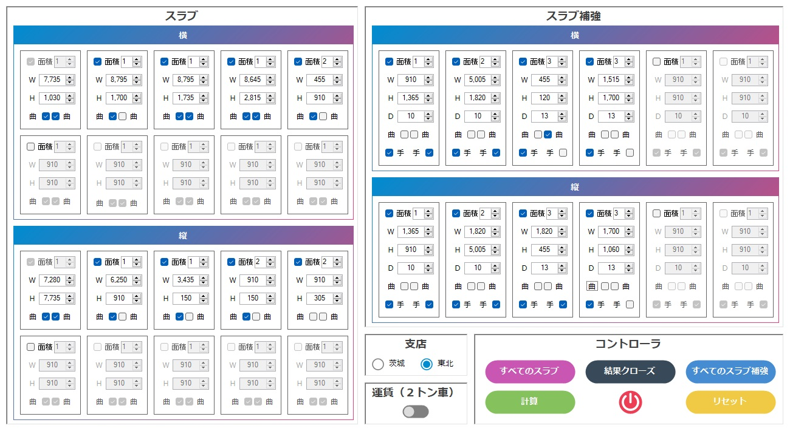

# SUMIRIN BETA FALLING APART SLAB PROJECT
Project to help 西山 team of エマール group calculate and summary スラブ住本林業（ベタ・バラバラ） from 文化シャッター partner.

## IMAGE DEMO
<p align='center'>
</img>
</p>

## CODE DEMO
```c#
/// <summary>
/// Check internet connection.
/// </summary>
/// <returns>Connection state.</returns>
internal static bool IsNetAvail()
{
    try
    {
        var buffer = new byte[32];
        return new Ping().Send(link_base, TIME_OUT, buffer, new PingOptions()).Status == Success;
    }
    catch (Exception)
    {
        return false;
    }
}
```

### PACKAGES
</img>
<div style='display:flex;'>

- Tynab.YANF » 1.0.1

</div>